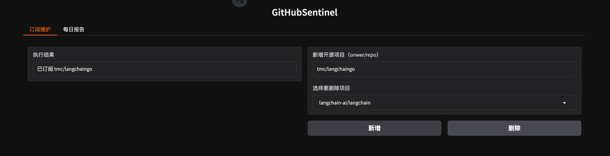

## 作业要求

1. 与 ChatGPT 深度对话，尝试使用 System role 提升报告质量和稳定性。

1. 练习 Gradio 基础组件和功能，尝试修改 v0.4.1 的布局。

## 作业内容

### Q1

* [改进的提示词跳转 ./prompts/report_prompt.txt](./prompts/report_prompt.txt)
* [改进的效果展示跳转](example/2024-10-20_to_2024-10-27_report.md)

### Q2

* [修改后的布局跳转](./src/gradio_server.py)

