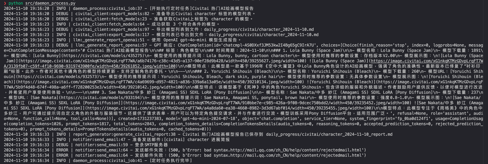

## 作业要求

1. 实现自定义的信息渠道获取和报告生成，并完成 Gradio ，Daemon Service 的适配，研发属于你自己的 GItHubSentinel v1.0 版本；
2. 更新单元测试代码，以完成 v1.0 的自动化测试和生产级发布。

## 作业实现

实现了 Civitai 热门AI绘画模型报告生成，并完成了单元测试代码。

### 测试用例

[跳转 Civitai 客户端测试用例](./tests/test_civitai_client.py)

### Daemon Service

[跳转 Daemon Service 修改点](./src/daemon_process.py#L36)

### Gradio 服务

- [跳转 Gradio 服务修改点1](./src/gradio_server.py#L35)
- [跳转 Gradio 服务修改点2](./src/gradio_server.py#L132)

