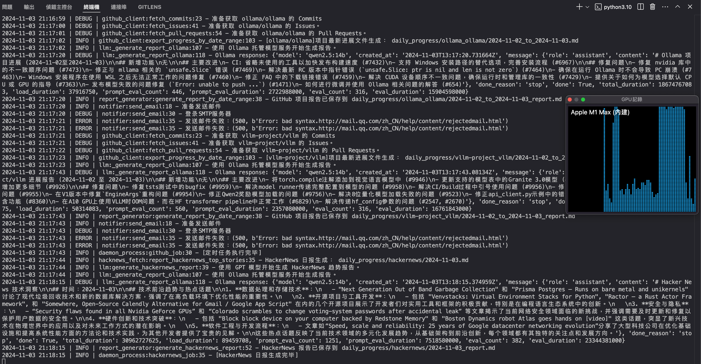
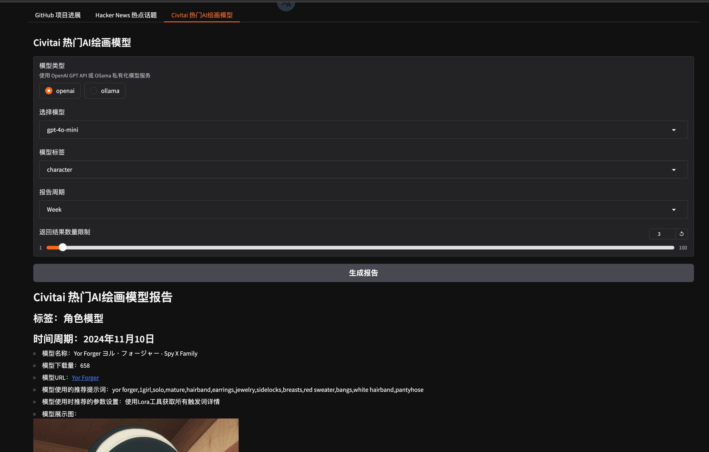
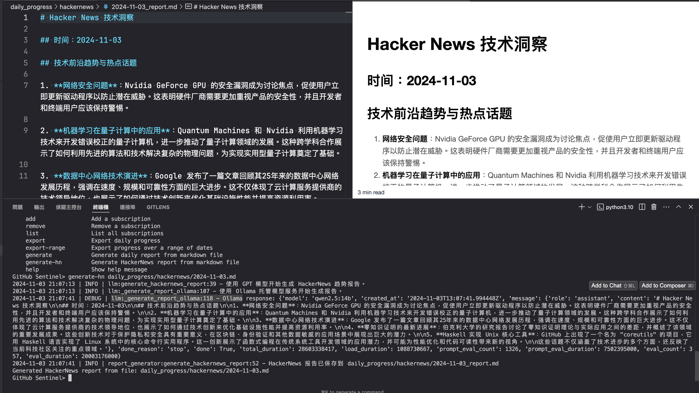

# 作业要求

在 GitHubSentinel v0.5 基础上，扩展实现 Hacker News 趋势报告生成。实现优先级：Daemon（Required） > Graido > Command

[可选] 扩展 GitHubSentinel v0.6，使用 Ollama 私有化部署的大模型服务，完成作业 1

## 0. 环境准备

- 选用 ollama 0.3.14 版本
- 本地化部署 qwen2.5:14b Q4_K_M 量化模型

## 1. Daemon

在 [daemon_process.py](src/daemon_process.py) 中添加 Hacker News 日报生成任务。

## 2. Gradio

在 [gradio_server.py](src/gradio_server.py) 中添加 Hacker News 日报生成界面。

## 3. Command

在 [command_handler.py](src/command_handler.py) 中添加 Hacker News 日报生成命令。

## 核心实现代码

- [hacknews_fetch.py](src/hacknews_fetch.py)
- [report_generator.py#generate_hackernews_report](src/report_generator.py#generate_hackernews_report)
- [llm.py#generate_hackernews_report](src/llm.py#generate_hackernews_report)
- [hacknews_prompt.txt](prompts/hacknews_prompt.txt)

